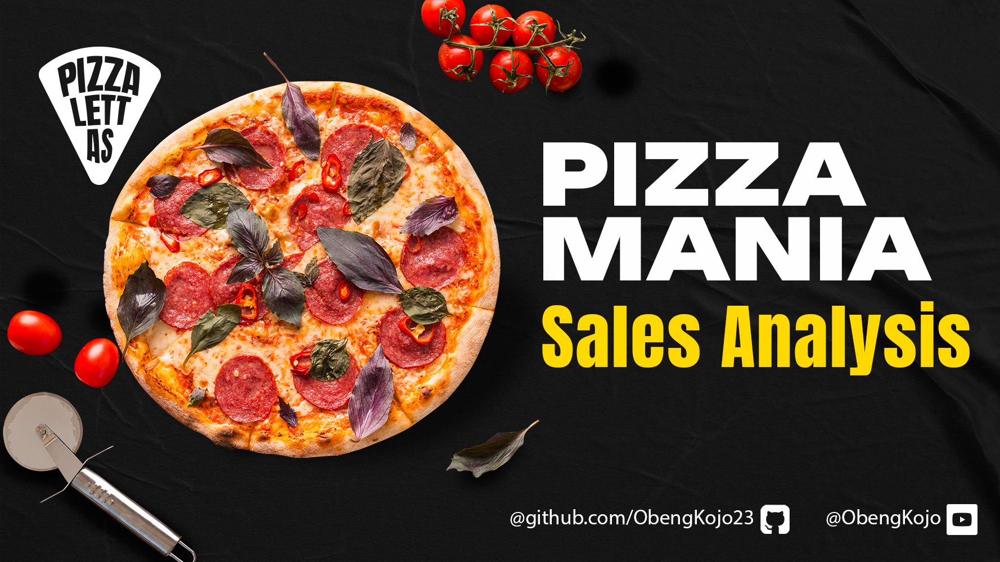
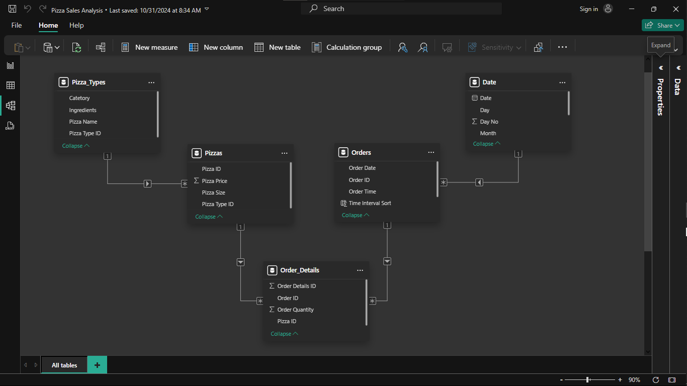
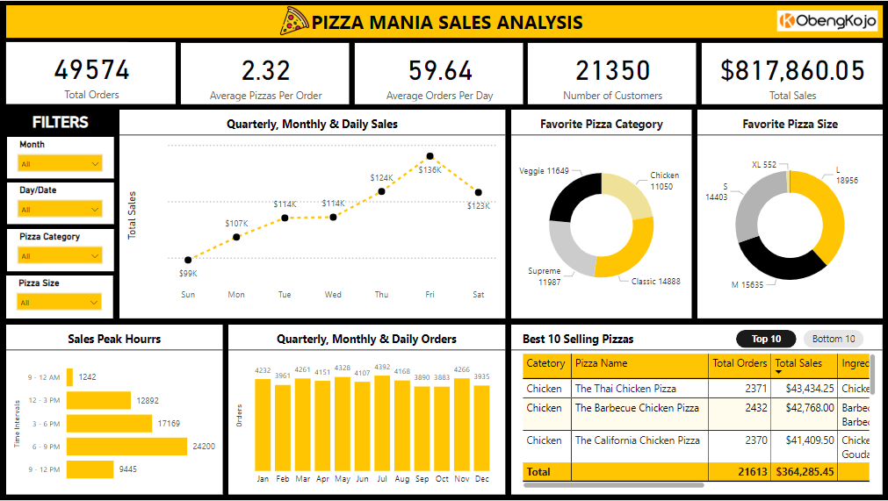
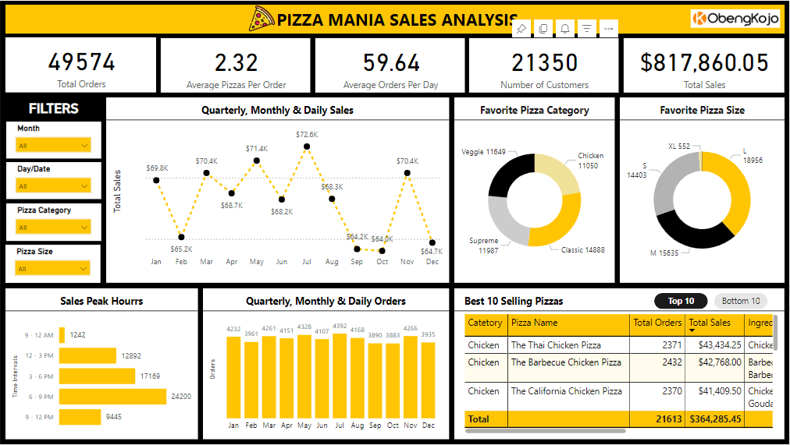
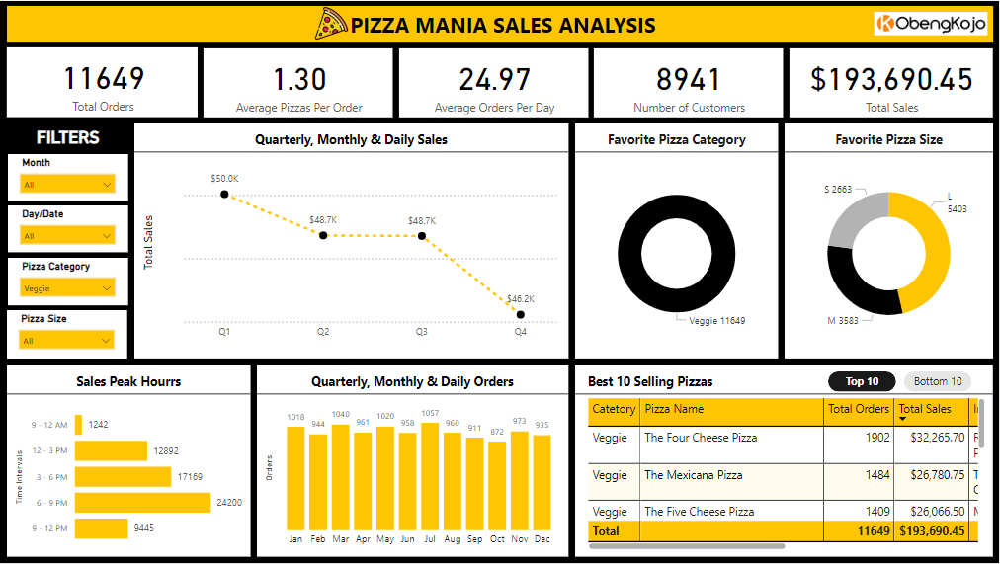
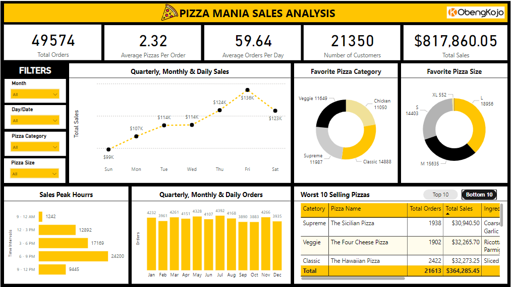

# 🍕 Pizza Mania Sales Analysis 🍕
---
<a id="cont"></a>


---
 <a id="one"></a>
## **🌍 1. Introduction**
<a href=#cont>Back to Project Structure</a>

### 1.1 Project Overview 📝 
This project focuses on supporting Pizza Mania’s commitment to growth, operational excellence, and exceptional customer experience through data-driven decision-making. This project provides a comprehensive exploratory data analysis (EDA) of a year's sales from `Pizza Mania`. By analyzing business data, the goal is to uncover key insights, identify emerging trends, and highlight actionable opportunities to enhance performance, optimize operations, and drive strategic growth. The dataset for the project includes details on each order, such as date and time, pizza type, size, quantity, price, and ingredients. Using Power BI, I explored customer behaviour, peak sales times, order trends, revenue, and potential areas for menu optimization and promotions.

### 1.2 Problem Statement ⚠️

#### 1.2.1 Project Objective 🎯
This project seeks to analyze our business data in order to optimize performance, maximize revenue, and refine our customer experience. Your task is to deliver a comprehensive analysis and an interactive dashboard that will enable leadership to make well-informed decisions.

#### 1.2.3 Key Deliverables 🔑
- - An interactive dashboard (Power BI or Tableau) covering:
  - Daily customer trends
  - Peak hour visuals
  - Average order size
  - Bestsellers and underperformers
  - Revenue breakdowns
  - Seasonality charts
  - Promotion recommendations
-	An executive summary document (1–2 pages) highlighting the most important insights and strategic recommendations.


[Click here](./Docs/Mania_Pizza_Project_Statement.docx) to download the full problem statement for this project.

---

<a id="cont"></a>

### **Project Structure**

<a href=#one>1. Introduction</a>

<a href=#two>2. Data Collection & Extraction</a>

<a href=#three>3. Loading, Cleaning & Transformation of Data (ETL Process)</a>

<a href=#four>4. Data Modelling</a>

<a href=#five>5. Data Report & Visualisaition</a>

<a href=#six>6. Executive Summary and Conclusion</a>

<a href=#seven>7. Project Details</a>

---
<a id="two"></a>
## **📋 2.  Data Collection & Extraction**
<a href=#cont>Back to Project Structure</a>

The datasets for this project contain a year's worth of pizza sales orders from `Pizza Mania`. The extracted datasets came in four separate `CSV` formats, which are detailed in the table below:

| Datasets        | Features            | Description                                                                                                                                                                       |
|---------------|------------------|-----------------------------------------------------------------------------------------------------------------------------------------------------------------------------------|
| orders        | order_id         | Unique identifier for each order placed by a table                                                                                                                                |
|               | date             | Date the order was placed (entered into the system before cooking & serving)                                                                                                    |
|               | time             | Time the order was placed (entered into the system before cooking & serving)                                                                                                    |
| order_details | order_details_id | Unique identifier for each pizza placed within each order (pizzas of the same type and size are kept in the same row, and the quantity increases)                                 |
|               | order_id         | Foreign key that ties the details in each order to the order itself                                                                                                               |
|               | pizza_id         | Foreign key that ties the pizza ordered to its details, like size and price                                                                                                       |
|               | quantity         | Quantity ordered for each pizza of the same type and size                                                                                                                         |
| pizzas        | pizza_id         | Unique identifier for each pizza (constituted by its type and size)                                                                                                               |
|               | pizza_type_id    | Foreign key that ties each pizza to its broader pizza type                                                                                                                        |
|               | size             | Size of the pizza (Small, Medium, Large, X Large, or XX Large)                                                                                                                    |
|               | price            | Price of the pizza in USD                                                                                                                                                         |
| pizza_types   | pizza_type_id    | Unique identifier for each pizza type                                                                                                                                             |
|               | name             | Name of the pizza as shown in the menu                                                                                                                                            |
|               | category         | Category that the pizza falls under in the menu (Classic, Chicken, Supreme, or Veggie)                                                                                             |
|               | ingredients      | Comma-delimited ingredients used in the pizza as shown in the menu (they all include Mozzarella Cheese, even if not specified; and they all include Tomato Sauce, unless specified) |

To access all four datasets for the project, [Click here](./Datasets) to download. 

---

<a id="three"></a>
## **⏳ 3.  Loading, Cleaning & Transformation of Data (ETL Process)**
<a href=#cont>Back to Project Structure</a>

### 3.1 Promote Row Headers 📝
Promoting headers means ensuring that a dataset's column names are recognized as the first row instead of data values.
- During loading the four datasets, the `pizza_type table` had its header row as a data value and, therefore, had to be promoted as a row header before loading it.

### 3.2 Rename Tables and Columns 📝 
After loading each table, checks were made on the table's and columns' naming format. 

- The observation was that both table and column names were in the `Snake Case` format (e.g., orders_table, order_details). I, therefore, renamed each of them to follow the standard and my preferred format for dashboard projects. For example, `orders_table` was renamed `Orders_Table`, `order_details` --> `Order_Details`.

### 3.3 Standardize Data Formats 📝
After loading data into Power BI, standardising data formats is crucial to ensure accuracy, consistency, and compatibility for analysis and visualization. This ensures that Power BI does not misclassify data types (e.g., treating dates as text), facilitates accurate data modelling, enables reliable sorting and filtering, and ensures data consistency across the report.

- Each column was inspected to ensure the correct data format. Fortunately, exploration indicated that all columns were in the proper format.

### 3.4 Handling Null Values  📝
Checking for null values in Power BI is crucial as it ensures data completeness, prevents calculation errors, maintains accurate relationships, and improves visualization reliability.
- The data quality (`Valid, Error and Empty`) was inspected under transform data mode.
- The observation indicated no null values in the dataset as all `Valid` values were `100%`.

---

<a id="four"></a>
## **📐 4.  Data Modelling**
<a href=#cont>Back to Project Structure</a>

Data modelling is the process of organizing data into tables and creating linked relationships or connecting them so that each table can easily communicate for analysis and report creation.

### 4.1 Creating Table Relationships 🔗 
- I used the snowflake schema by organizing the data into `Fact` and `Dimension` tables. The fact table contains the key metrics or performance data, while the dimension tables store descriptive attributes related to those metrics. This structure helps optimize query performance and improves the clarity of relationships between data points, ensuring efficient analysis and reporting.

  The table below shows the `Fact` and `Dimension` Tables.

  | Fact Table     | Dimension Tables   |
  |----------------|--------------------|
  | Order Detials  | Pizza Type         | 
  |                | Orders             |
  |                | Pizzas             |

- I created a new `Date Table` (Calender Table) to the schema. This new Date table is important for more efficient and flexible time-based analysis during the analysis. 

  The below DAX formula was used to create the new Date Table.
  ```sql
  
  Date = 
  ADDCOLUMNS(
      CALENDAR(MIN(Orders[Order Date]), MAX(Orders[Order Date])),
      "Year", YEAR([Date]),
      "Month", FORMAT([Date], "mmm"),
      "Month No", MONTH([Date]),
      "Quarter", FORMAT([Date], "\QQ"),
      "Day", FORMAT([Date], "ddd"),
      "Day No", WEEKDAY([Date])
  )
 
  ```
  A screenshot of the final Table Relationship
   

### 4.2 Creating Calculated Measures and Columns ➗
The decision to create calculated measures and columns stems from the questions to be answered and the insights to be uncovered. 
- I first created a measures table. I plan to store all my measures under this table for better organisation and easy accessibility.
- All measures were created based on the under-listed questions
  1. **How many customers do we have each day?**
  3. **Are there any peak hours?**
  4. **How many pizzas are typically in an order?** 📝
  5. **Do we have any bestsellers?**
  6. **How much money did we make this year?**
  7. **Can we identify any seasonality in the sales?**
  8. **Are there any pizzas we should take off the menu or any promotions we could leverage?**
- Below is the list of all calculated measures and columns created
  
  ## Calculated Measures
  
  ### 1.  To calculate `How many customers for each day`.
  ```sql
   Number of Customers = DISTINCTCOUNT(Order_Details[Order ID])
  ```
  #### Explanation of Measure
   - I used this measure to count the number of unique Order ID values in the Order_Details table, which essentially gives the number of unique customer transactions (i.e., the number of unique orders).
   - Since the datasets had no Customer table, I used the `Order ID` as a proxy for unique customers, keeping in mind that this measure will give the count of distinct orders but not necessarily distinct customers if multiple orders are placed by the same customer.
     

  ### 2.  To calculate the `The Average Orders Per Day`. 
   ```sql
    Average Orders Per Day = 
    DIVIDE(
        DISTINCTCOUNT(Order_Details[Order ID]),
        DISTINCTCOUNT(Orders[Order Date]),
        0
    )
   ```
  #### Explanation of Measure
   - `DISTINCTCOUNT(Order_Details[Order ID])` This counts the unique orders from the Order_detials Table.
   - `DISTINCTCOUNT(Orders[Order Date])` Then this counts the unique days with orders.
   - To ensure that there is no division by zero errors, I used `DIVIDE(..., 0)`.

   
  ### 3. To calculate the `The Average Number of Pizzas Per Order`.
   ```sql
   Average Pizzas Per Order =
    DIVIDE(
      SUM(Order_Details[Order Quantity]), 
      DISTINCTCOUNT(Order_Details[Order ID]), 
      0
   )
   ```
   #### Explanation of the Measure
    - `SUM(Order_Details[Order Quantity])`: This extracts the total number of pizzas ordered.
    - `DISTINCT COUNT (Order_Details[Order ID])` This will count the unique orders made based on the Order ID and ensure that each order is only counted once, even if there are multiple pizzas in a single order.
    - The `DIVIDE` function is used to perform the division.
    - To ensure that there is no division by zero errors, I used `DIVIDE(..., 0)`.

  ### 4. To calculate the `The Total Orders`.
   ```sql
     Total Orders = SUM(Order_Details[Order Quantity])
   ```
   #### Explanation of the Measure
    - `Order_Details[Order Quantity]`: This references the Order Quantity column in the Order_Details table that contains the number of pizzas ordered in each transaction.
    -  The `SUM` function is then used to sum up all the values in the Order Quantity Column.
    -  In summary, the measure calculates the total number of pizzas ordered by adding all values in the Order Quantity column across all rows in the Order_Details table.

  ### 5. To calculate the `The Total Sales`.
     ```sql
     
     Total Sales = 
     SUMX(
         'Order_Details',
         'Order_Details'[Order Quantity] * RELATED(Pizzas[Pizza Price])
         )
     ```
  #### Explanation of the Measure
     - `SUMX` was used to iterate over the 'Order_Details' table. Then, multiply the order quantity by the pizza price (From the Pizza table) for each row.
     - The measure using the iteration then sums up the values to calculate the total sales for all orders.
     - In summary, the measure calculates the total revenue by multiplying the number of pizzas ordered by their prices and sums the results.
       

   ## Calculated Columns

   ### 6. To determine whether there were any peak hours, I needed to create two new calculated columns. 
    - I had to make use of the time column under Orders Table
    - Sorting the time column descending and ascending respectively indicated that the `MINIMUM` time was `9:52:21` and the `MAXIMUM` time was `23:05:52`.
    - From this observation, I decided to calculate Time Intervals from `9:00 PM` to `12:00 PM`.
    - The Time Interval Sort column was created to allow me to easily aggregate the time intervals.

    ```sql
     Time Intervals = 
     SWITCH(
         TRUE(),
         Orders[Order Time] >= TIME(9,0,0) && Orders[Order Time] <= TIME(12,0,0), "9 - 12 AM",
         Orders[Order Time] >= TIME(12,0,0) && Orders[Order Time] <= TIME(15,0,0), "12 - 3 PM",
         Orders[Order Time] >= TIME(15,0,0) && Orders[Order Time] <= TIME(18,0,0), "3 - 6 PM",
         Orders[Order Time] >= TIME(18,0,0) && Orders[Order Time] <= TIME(21,0,0), "6 - 9 PM",
         Orders[Order Time] >= TIME(21,0,0) && Orders[Order Time] <= TIME(23,59,59), "9 - 12 PM"
     )
    ```
    
    ```sql
     Time Interval Sort = 
     SWITCH(
         TRUE(),
         Orders[Order Time] >= TIME(9,0,0) && Orders[Order Time] <= TIME(12,0,0), 1,
         Orders[Order Time] >= TIME(12,0,0) && Orders[Order Time] <= TIME(15,0,0), 2,
         Orders[Order Time] >= TIME(15,0,0) && Orders[Order Time] <= TIME(18,0,0), 3,
         Orders[Order Time] >= TIME(18,0,0) && Orders[Order Time] <= TIME(21,0,0), 4,
         Orders[Order Time] >= TIME(21,0,0) && Orders[Order Time] <= TIME(23,59,59), 5
     )
     ```
<a id="five"></a>
## **📊 5.  Data Report & Visualisaition**
<a href=#cont>Back to Project Structure</a>

This is where I jumped to the report view and created all the visuals to answer key questions and give further insights to the CEO of Pizza Mania.
- `Cards`: Was used to display key metrics (Total Sales, Total Orders, Number of Customers, Average Pizzas Per Order and Average Orders Per Day).
- `Line Chart`: Was used to show trends over time (Quarterly, Monthly and Daily sales).
- `Bar/Column Charts` Were used to show The Peak Hours and compare Pizza Orders (Quarterly, Monthly and Daily sales).
- `Pie Charts`: Were used to visualise the distribution of Favorite Pizza Categories ((Classic, Supreme, Veggie, and Chicken) and Favorite Pizza Sizes (XL, L, M, and S).
- `Tables`: Was used to Provide detailed breakdowns of The Top 10 Best Selling Pizzas and Bottom 10 Worst Selling Pizzas.
- `Slicers`: I used four slicers (Pizza Category, Pizza Size, Month, and Day/Date) to allow for filtering the data by specific Pizza size and category, Month, Day and Date of sales.

Below is a short video visual demonstration of the Dashboard for the Report.


Screenshot 1


Screenshot 2


Screenshot 3


Screenshot 4

  

<a id="Six"></a>
## **🔚 6. Executive Summary and Conclusion**
<a href=#cont>Back to Project Structure</a>

### 6.1 Executive Summary 

 [Click here](./Docs/Executive_Summary.docx) to download the complete executive summary document highlighting the most important insights and strategic recommendations for Pizza Mania.
 
#### Key Performance Indicators (KPIs) 🔑 

The following KPIs were identified to measure the performance and trends in sales at Pizza Mania. These KPIs help uncover insights into customer behaviour and sales patterns:

- **`Daily Order Count:`** Tracks the number of customers daily, helping to identify busy and slow days.

- **`Daily Sales:`** Analyzes sales by day to identify peak times, guiding staffing and operational planning.

- **`Average Order Size:`** Measures the typical number of pizzas in each order, giving insight into customer ordering patterns (e.g., whether they often order in groups or as individuals).

- **`Bestselling Pizzas:`** Identifies the most popular pizza types and sizes, helping in inventory planning and promotion targeting.

- **`Total Sales:`** Calculates total income generated within the year, providing a high-level view of business performance.

- **`Revenue by Pizza Type:`** Breaks down revenue by each type of pizza (Classic, Supreme, Veggie, and Chicken), revealing which categories are the most profitable.

- **`Seasonal Revenue Trends:`** Shows revenue by months, weeks, and days of the week, helping to identify sales cycles and potential seasonal promotions.

- **`Menu Optimization Opportunities:`** Identifies low-performing pizzas that may need to be discontinued or adjusted and suggests potential promotions to increase sales of specific items.

- **`Average Order Value (AOV):`** Measures the average revenue per order, helpful in setting targets for up-selling or cross-selling.
  
- **`Sales Margin by Pizza Type:`** Tracks the margin of each pizza type, supporting decisions on pricing adjustments or cost-cutting.

These KPIs were selected to provide a comprehensive view of Pizza Mania’s sales dynamics, customer preferences, and overall performance. They guide decision-making to optimize sales, enhance customer satisfaction, and increase profitability.

### 6.2 Conclusion ✅
This Power BI-driven analysis of Pizza Mania sales provides valuable insights into customer behaviour, sales performance, and product popularity. By leveraging well-structured data modelling, dynamic DAX measures, and interactive visualizations, the project enables Pizza Mania's CEO to make informed business decisions based on data-driven evidence.  

#### Key findings from the analysis include:  
- **Sales Performance:** Tracking total revenue, order trends, and peak sales periods.  
- **Customer Insights:** Understanding daily customer activity and purchasing patterns.  
- **Product Trends:** Identifying the most popular pizza types, sizes, and categories.  
- **Time-Based Analysis:** Examining sales variations by day, month, and quarter.  

With these insights, Pizza Mania can optimize inventory management, refine marketing strategies, and enhance customer satisfaction. The interactive Power BI dashboard ensures continuous monitoring and data exploration, allowing for ongoing strategic improvements in sales operations.

---

<a id="Seven"></a>
## **🚀 7. Project Details**
<a href=#cont>Back to Project Structure</a>
### 7.1 Tools and Technologies Used 🛠
- **Power BI Desktop**: The primary tool for data visualization and analysis.
- **DAX (Data Analysis Expressions)**: Used for calculations and data manipulation.
- **Power Query**: For data transformation and cleansing.
- **Power BI Service**: For sharing reports and dashboards.
- **GitHub**: For version control and collaboration on project files, including sharing the Power BI reports and documentation.
- **Data Sources**: Excel spreadsheets.
- **Visualization Types**: Bar charts, line graphs, pie charts, tables, and cards.
- **Markdown:** Used for project documentation, including README files, to enhance clarity and structure for this final report.

### 7.2 Skills Employed 🧠 
- **Power BI Data Modeling:** Structured data using a **snowflake schema**, defining **fact and dimension tables** to support efficient data analysis and visualization.
- **DAX Measures and Calculations:** Created **calculated measures** using DAX functions such as `SUMX()`, `DISTINCTCOUNT()`, and `RELATED()` to analyze sales, customer count, and revenue.
- **Customer Segmentation:** Analyzed purchasing patterns, order frequency, and sales contribution to categorize customers and identify high-value buyers.
- **Product Performance Analysis:** Identified **top-selling pizza types, categories, and sizes** to help optimize stock and menu offerings.
- **Time-Series Analysis:** Evaluated sales trends by **day, month, and quarter**, identifying peak sales periods and seasonal patterns.
- **Business Intelligence & Decision Support:** Provided actionable insights on **customer behavior, sales trends, and product demand** to inform strategic decisions.
- **Interactive Dashboard Development:** Designed a **Power BI dashboard** with **cards, bar charts, pie charts, line charts, tables, and slicers** for real-time data exploration.
- **Data Filtering and Drill-through Analysis:** Implemented **cross-filtering, slicers, and drill-through features** for interactive and detailed reporting.
- **Project Documentation:** Documented **data preparation, DAX measures, insights, and visualization processes** for clarity and reproducibility.

---

### 7.3 How to Run This Project 🚀 

1. **Clone the Repository**  
   Run the following command to clone the repository to your local machine:
   ```bash
   git clone https://github.com/ObengKojo23/pizza-sales-analysis.git
2. **Download Power BI Desktop**  
   You can download Power BI Desktop from the official Microsoft website: [Download Power BI Desktop](https://powerbi.microsoft.com/desktop/).
3. **Load the dataset**
   Load all the datasets into Power BI to explore the interactive dashboard.
--- 

### 7.4 File Structure 💾

- `Dashboard/`: Power BI file for the dashboard.
- `Datasets/`: Contains the datasets for analysis.
- `Docs/`: Word documents for the Problem Statement and Executive Summary of the project.
- `images/`: Banner image, Final dashboard images and gif file.   
- `README.md`: Project overview and documentation.
- `LICENSE`: The project is licensed under the Apache License 2.0.
---

### 7.5 References 👋
1. **Maven Analytics** for providing the [Pizza Sales dataset](https://www.mavenanalytics.io/data-playground?dataStructure=Multiple%20tables&order=date_added%2Cdesc&page=4&pageSize=5).
2. **Power BI Community** for visualization inspiration and dashboarding techniques.
3. **Pizza Icons**: Pizza icon used in the project was created by [Freepik - Flaticon](https://www.flaticon.com/free-icons/pizza).
4. Original Banner image sourced from [FreePik](https://www.freepik.com) and redesigned by me `(ObengKojo)`.

---

## Contact 📞
For any questions or suggestions, feel free to reach out:

- **LinkedIn**: [LinkedIn Page](https://www.linkedin.com/in/obengafari)
- **GitHub**: [GitHub page](https://github.com/ObengKojo23)
- **YouTube**: [My YouTube tutorials](https://youtube.com/@obengkojo)
---


